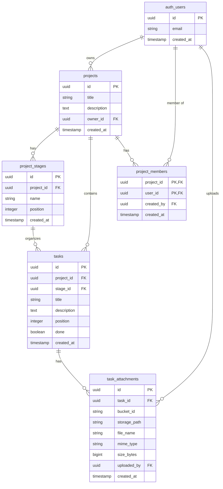

# Taskboard

A modern, collaborative task management application built with Vanilla JavaScript, Bootstrap, and Supabase. Taskboard provides a Trello-style kanban interface for organizing projects and tasks with team collaboration features.

## 📋 Project Description

Taskboard is a full-featured project and task management system that enables teams to organize their work efficiently. The application provides:

**Key Features:**
- **User Management**: Secure registration and authentication with email/password
- **Project Organization**: Create, edit, and delete projects with customizable stages
- **Task Management**: Create tasks with descriptions, attachments, and drag-and-drop positioning
- **Team Collaboration**: Add team members to projects and collaborate in real-time
- **Kanban Boards**: Visual task boards with customizable stages/columns
- **File Attachments**: Upload and manage task attachments stored in Supabase Storage
- **Role-Based Access**: Project owners can manage members while members can collaborate on tasks

**User Roles:**
- **Project Owner**: Can create projects, manage project settings, add/remove members, and has full access to all project data
- **Project Member**: Can view projects they're added to, create/edit/delete tasks, and add attachments
- **Guest**: Can only access public pages (landing, login, register)

## 🏗️ Architecture

Taskboard follows a modern client-server architecture with a clean separation of concerns:

### Frontend
- **Framework**: Vanilla JavaScript (ES6 modules)
- **UI Library**: Bootstrap 5.3.7 + Bootstrap Icons
- **Build Tool**: Vite 7.1.3
- **Routing**: Custom client-side router with authentication guards
- **Module Structure**: Component-based architecture with separate HTML, CSS, and JS files

### Backend
- **Platform**: Supabase (Backend-as-a-Service)
- **Database**: PostgreSQL 
- **Authentication**: Supabase Auth (email/password)
- **Storage**: Supabase Storage (task attachments)
- **API**: Supabase REST API with automatic generation
- **Security**: Row Level Security (RLS) policies for data protection

### Deployment
- **Hosting**: Netlify
- **Build**: Static SPA with client-side routing
- **CI/CD**: Automatic deployment from Git repository

### Technology Stack
```
Frontend:
├── Vanilla JavaScript (ES6+)
├── Bootstrap 5.3.7
├── Bootstrap Icons 1.13
└── Vite (dev server & bundler)

Backend:
├── Supabase
├── PostgreSQL (database)
├── Supabase Auth (authentication)
└── Supabase Storage (file storage)

Development:
├── Node.js & npm
├── ES6 Modules
└── dotenv (environment variables)

Deployment:
└── Netlify (static hosting)
```

## 🗄️ Database Schema Design

The database consists of five main tables with relationships managed through foreign keys and Row Level Security policies:



### Table Descriptions

**`projects`**: Core project entity owned by a user
- Owner can manage all project settings and members
- Members can view and collaborate on project tasks

**`project_members`**: Many-to-many relationship between projects and users
- Enables team collaboration
- Only project owners can add/remove members

**`project_stages`**: Kanban board columns (e.g., "To Do", "In Progress", "Done")
- Custom stages per project
- Position determines display order

**`tasks`**: Individual work items within projects
- Assigned to specific stages for kanban organization
- Position determines order within a stage
- Supports drag-and-drop reordering

**`task_attachments`**: File metadata for task attachments
- Links to actual files in Supabase Storage
- Tracks uploader, file size, and MIME type
- Automatically deleted when task is deleted

### Security
All tables implement Row Level Security (RLS) with policies ensuring:
- Users can only access projects they own or are members of
- Only project owners can modify project settings and manage members
- All members can manage tasks and attachments within accessible projects

## 🚀 Local Development Setup Guide

### Prerequisites
- **Node.js**: Version 18 or higher
- **npm**: Version 9 or higher
- **Supabase Account**: Create a free account at [supabase.com](https://supabase.com)
- **Git**: For version control

### Step-by-Step Setup

#### 1. Clone the Repository
```bash
git clone <repository-url>
cd Taskboard
```

#### 2. Install Dependencies
```bash
npm install
```

#### 3. Set Up Supabase Project

**Create a new Supabase project:**
1. Go to [supabase.com](https://supabase.com) and sign in
2. Click "New Project"
3. Fill in project details and wait for setup to complete

**Get your credentials:**
1. Go to Project Settings → API
2. Copy the Project URL (e.g., `https://xxxxx.supabase.co`)
3. Copy the `anon/public` key

#### 4. Configure Environment Variables

Create a `.env` or `.env.local` file in the project root:

```bash
VITE_SUPABASE_URL=https://your-project-ref.supabase.co
VITE_SUPABASE_ANON_KEY=your-anon-public-key-here
```

#### 5. Apply Database Migrations

Run migrations in order using Supabase SQL Editor or CLI:

**Option A: Using Supabase Dashboard**
1. Open your Supabase project
2. Go to SQL Editor
3. Run each migration file in order:
   - `supabase/migrations/20260212120000_initial_schema.sql`
   - `supabase/migrations/20260217103000_task_attachments_storage.sql`
   - `supabase/migrations/20260217130000_project_members_and_member_access.sql`
   - `supabase/migrations/20260217143000_member_search_functions.sql`
   - `supabase/migrations/20260217162000_restore_projects_insert_delete_policies.sql`
   - `supabase/migrations/20260217170000_fix_security_definer_functions.sql`
   - `supabase/migrations/20260217171000_undo_security_invoker.sql`
   - `supabase/migrations/20260217172000_fix_parameter_ambiguity.sql`

**Option B: Using Supabase CLI**
```bash
supabase link --project-ref your-project-ref
supabase db push
```

#### 6. (Optional) Seed Sample Data

Load sample users, projects, and tasks:
```bash
npm run seed
```

#### 7. Start Development Server
```bash
npm run dev
```

The app will be available at `http://localhost:5173`

### Development Workflow

**Available Commands:**
- `npm run dev` — Start development server (hot reload enabled)
- `npm run build` — Build for production (outputs to `dist/`)
- `npm run preview` — Preview production build locally
- `npm run seed` — Seed database with sample data

**Development Tips:**
- The dev server supports hot module replacement (HMR)
- Check browser console for errors and logs
- Use browser DevTools Network tab to debug API calls
- Supabase dashboard provides real-time database monitoring

## 📁 Key Folders and Files

### Project Structure Overview

```
Taskboard/
├── src/                          # Source code
│   ├── main.js                   # Application entry point
│   ├── router.js                 # Client-side routing logic
│   ├── components/               # Reusable UI components
│   │   ├── header/               # App header with navigation
│   │   ├── footer/               # App footer
│   │   └── task-editor/          # Task create/edit modal
│   ├── lib/                      # Shared libraries
│   │   └── supabaseClient.js     # Supabase client initialization
│   ├── pages/                    # Page components
│   │   ├── index/                # Landing page
│   │   ├── login/                # Login page
│   │   ├── register/             # Registration page
│   │   ├── dashboard/            # User dashboard
│   │   ├── projects/             # Project list & management
│   │   │   ├── add/              # Create project page
│   │   │   ├── edit/             # Edit project page
│   │   │   ├── projectMembers.js # Member management logic
│   │   │   └── ...
│   │   ├── taskboard/            # Kanban board view
│   │   └── notfound/             # 404 page
│   └── styles/                   # Global styles
│       └── app.css               # Application-wide CSS
├── supabase/                     # Database & backend
│   ├── migrations/               # SQL migration files (versioned)
│   └── seed-data/                # Sample data scripts
│       └── seed-sample-db-data.js
├── index.html                    # Main HTML entry point
├── package.json                  # npm dependencies & scripts
├── vite.config.js                # Vite build configuration
├── netlify.toml                  # Netlify deployment config
└── README.md                     # This file
```

### File Descriptions

#### Root Files
- **`index.html`**: Main HTML file, single entry point for the SPA
- **`package.json`**: Dependencies, scripts, and project metadata
- **`vite.config.js`**: Vite configuration (dev server port, build settings)
- **`netlify.toml`**: Netlify deployment configuration with SPA redirects
- **`.env`**: Environment variables (not in Git, create locally)

#### Source Code (`src/`)
- **`main.js`**: Application initialization, mounts router and global components
- **`router.js`**: Client-side routing with navigation guards for auth
  - Defines all routes with authentication requirements
  - Handles route rendering and page lifecycle
  - Manages authentication state checks

#### Components (`src/components/`)
Each component is organized in its own folder with HTML template, CSS styles, and JS logic:

- **`header/`**: Application header with navigation menu, logout functionality
- **`footer/`**: Application footer with copyright and links  
- **`task-editor/`**: Reusable modal for creating and editing tasks
  - Used in taskboard for task management
  - Handles task form validation and submission

#### Library (`src/lib/`)
- **`supabaseClient.js`**: Initialized Supabase client for database and auth
  - Exports configured `supabase` instance
  - Used across all pages and components

#### Pages (`src/pages/`)
Each page follows a consistent structure with three files:
- **`{page}.html`**: HTML template for the page
- **`{page}.css`**: Page-specific styles
- **`{page}.js`**: Page logic, data fetching, and event handlers
  - Exports `render{Page}Page()` - returns HTML string
  - Exports `init{Page}Page()` - initializes page after render

**Page-specific files:**
- **`index/`**: Landing page for guests
- **`login/`**: User login with email/password
- **`register/`**: User registration form
- **`dashboard/`**: Authenticated user dashboard
- **`projects/`**: Project list page with search and member management
  - **`add/`**: Form to create new project
  - **`edit/`**: Form to edit existing project
  - **`projectMembers.js`**: Shared logic for adding/removing members
- **`taskboard/`**: Main kanban board interface
  - Drag-and-drop task management
  - Stage management
  - Task attachments
- **`notfound/`**: 404 error page

#### Styles (`src/styles/`)
- **`app.css`**: Global application styles, CSS variables, utility classes

#### Database (`supabase/`)
- **`migrations/`**: Versioned SQL migration files
  - Applied in chronological order
  - Never modify existing migrations after applying
  - Create new migrations for schema changes
- **`seed-data/`**: Scripts to populate database with sample data
  - **`seed-sample-db-data.js`**: Node script to create users, projects, stages, and tasks

### Module Organization

The project uses **ES6 modules** with a clear separation of concerns:
- **Pages**: Handle routing, user interaction, and business logic
- **Components**: Reusable UI elements used across multiple pages
- **Library**: Shared utilities and configurations
- **Styles**: Scoped and global CSS

Each module is self-contained with its own HTML, CSS, and JS, making the codebase maintainable and scalable.

## 📝 Development Guidelines

### Code Style
- Use ES6+ JavaScript features (arrow functions, destructuring, async/await)
- Follow modular architecture - one feature per file
- Keep HTML templates readable with proper indentation
- Use Bootstrap utilities for styling when possible
- Write semantic HTML with proper accessibility attributes

### Database Migrations
- **Never edit existing migrations** after they've been applied
- Always create new migration files for schema changes
- Name migrations with timestamp prefix: `YYYYMMDDHHMMSS_description.sql`
- Test migrations on local environment before applying to production
- Keep a copy of all migration SQL files in version control

### Security Best Practices
- All database tables use Row Level Security (RLS)
- Environment variables for sensitive credentials (never commit `.env`)
- Authentication guards on protected routes
- Input validation on both client and server side
- File upload restrictions (size, type)

## 🌐 Routes

- `/` → Landing page
- `/dashboard` → User dashboard (authenticated)
- `/login` → Login page (guest only)
- `/register` → Registration page (guest only)
- `/projects` → Project list (authenticated)
- `/projects/add` → Create new project (authenticated)
- `/projects/edit?id={projectId}` → Edit project (authenticated, owner only)
- `/projects/{projectId}/tasks` → Taskboard kanban view (authenticated, owner or member)

## 🔧 Commands

```bash
npm install          # Install dependencies
npm run dev          # Start development server at http://localhost:5173
npm run build        # Build for production (outputs to dist/)
npm run preview      # Preview production build locally
npm run seed         # Seed database with sample data
```
- `tasks`
- RLS policies for owner-scoped access

### 2) Seed sample data (optional)

Run:

```bash
npm run seed
```

The seed script creates/reuses 3 sample users, 4 projects, default stages, and sample tasks.

Detailed seed docs: [supabase/seed-data/README.md](supabase/seed-data/README.md)

## Project structure

- `src/pages/*` — page modules (`html`, `css`, `js`)
- `src/components/*` — reusable UI modules
- `src/router.js` — client-side route handling + auth guards
- `src/lib/supabaseClient.js` — Supabase client initialization
- `supabase/migrations/*` — SQL migrations
- `supabase/seed-data/*` — database seed scripts and docs
